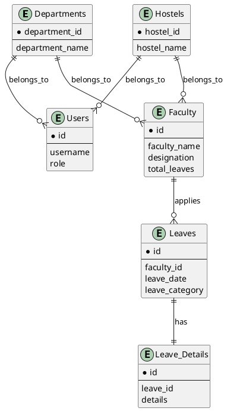

# Simple ER Diagram for Leave Management System

## Main Entities:
- **Users**: System users with roles (admin, staff, etc.)
- **Departments**: Academic departments
- **Hostels**: Residential hostels
- **Faculty**: Teaching and non-teaching staff
- **Leaves**: Leave records for faculty
- **Leave_Details**: Additional details for leaves

## Key Relationships:
- Departments and Hostels contain Users and Faculty
- Faculty apply for Leaves
- Each Leave can have detailed information

## Simple Text Diagram:

```
Departments ───┬── Users
               │
               └── Faculty ─── Leaves ─── Leave_Details

Hostels ───────┬── Users
               │
               └── Faculty
```

## PlantUML Code for Simple Diagram:


